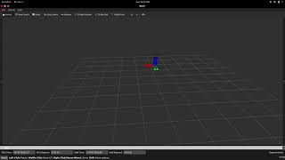
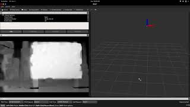
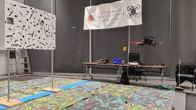

# ENAE788M - Project 4
This repo contains the implementation of our solution as required in [this](https://prgaero.github.io/2019/proj/p4b/) project for the course [ENAE788M](http://prg.cs.umd.edu/enae788m).

This project required completion of two tasks:
**Task 1:** Cross over the bridge while avoiding the river.
**Task 2:** Detect the wall infront of your quadrotor and go through above or below the wall, depending on the height of the wall.

## Implementation and using this repo
The submission is a rospackage and it expects a certain directry structure to work.

In your source folder of workspace create a package named `noob_quaternions`
```
 catkin_create_pkg noob_quaternions rospy roscpp std_msgs geometry_msgs nav_msgs sensor_msgs visualization_msgs
```

In the src folder of noob_quaternions create a directory named `drone-course`
```
mkdir drone-course
```

Place the folder `wall_n_river` inside drone-course

Now, to run the wall detection, use
```
python wall_detection.py
``` 

To run the bridge detection, use
```
python river.py
``` 
To run the Neural Network for flow, use
```
python run.py
``` 
## Results
Exact details about our implementation for this project are outlined in the [submission report](Report.pdf). The videos of the live demos and their plots in rviz are present below

#### Cross the Bridge
The odometry plot begins with quadrotor mid air with the red axis pointing towards the river. The river is parallel to the plane formed with red and green axis.
- Rviz visualization
[](https://youtu.be/I7XyC80DMCY)
- Live demo
[](https://youtu.be/I7XyC80DMCY)

#### Avoid the wall
The odometry plot begins with quadrotor taking off from the origin and the window is placed to the left of the quadrotor (in front of green axis as seen from the first 2 seconds of the video )
- Rviz visualization
[](https://youtu.be/QEWkkLIMmyA)
- Live demo
[](https://youtu.be/23Uqc3Fq_Ns)
